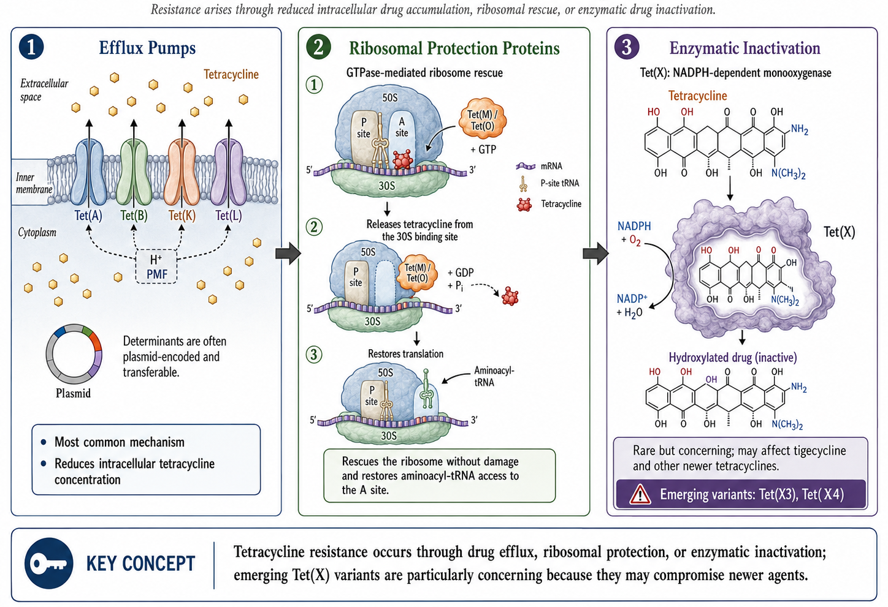

[HTML lecture slides](https://russlewisbo.github.io/tetracyclines/tetracyclines-slides.html#/title-slide) <br>
[Link to recorded lecture]() <br>


# Short View Summary {#sec-summary}

## Doxycycline

::: {.callout-note}
## Quick Reference: Doxycycline
- **Usual adult dose:** 100 mg orally or IV every 12 hours
- **Renal/hepatic failure:** No dose adjustment required
- **Common adverse effects:** GI upset, photosensitivity, rash, Candida vaginitis, dental staining in children
- **Contraindications:** Pregnancy, breastfeeding; avoid >10 days in children <8 years
- **Drug interactions:** No important drug-drug interactions
:::

**Indications include:**

- Treatment of rickettsioses, scrub typhus, ehrlichiosis, anaplasmosis, psittacosis, actinomycosis
- Pneumonia due to *Mycoplasma pneumoniae* or *Chlamydia pneumoniae*
- Lyme disease, syphilis, rat bite fever
- *Chlamydia trachomatis* infection (cervicitis, urethritis, lymphogranuloma venereum, trachoma)
- Whipple disease and community-associated methicillin-resistant *Staphylococcus aureus* (CA-MRSA) infection
- Combination therapy for brucellosis, tularemia, malaria, *Helicobacter pylori* infection
- Prophylaxis against leptospirosis, malaria, Lyme disease (tick bite), sexually transmitted infections

## Tetracycline

::: {.callout-note}
## Quick Reference: Tetracycline
- **Usual adult dose:** 250 to 500 mg orally every 6 hours
- **Renal failure:** Dose should be reduced
- **Contraindications and adverse effects:** Same as doxycycline
:::

## Minocycline

::: {.callout-note}
## Quick Reference: Minocycline
- **Usual adult dose:** 200 mg orally or IV loading, then 100 mg every 12 hours
- **Renal/hepatic failure:** No dose adjustment necessary
- **Adverse effects:** Similar to doxycycline, but with more vertigo
- **Note:** Doxycycline usually preferred, except minocycline preferred for nocardiosis
:::

## Tigecycline (A Glycylcycline)

::: {.callout-warning}
## FDA Boxed Warning
Tigecycline carries an FDA boxed warning regarding increased risk of death compared with other antibiotics. Reserve for situations where alternative treatments are not suitable.
:::

::: {.callout-note}
## Quick Reference: Tigecycline
- **Usual adult dose:** 100 mg loading, then 50 mg IV every 12 hours
- **Renal failure:** No dose adjustment required
- **Severe hepatic failure (Child-Pugh C):** 100 mg loading, then 25 mg every 12 hours
- **Common adverse effects:** Similar to doxycycline; nausea and vomiting more frequent; anorexia, dry mouth, dysgeusia
- **Indications:** Complicated skin/skin structure infections, complicated intraabdominal infections, community-acquired bacterial pneumonia
:::

## Eravacycline (A Fluorocycline)

::: {.callout-note}
## Quick Reference: Eravacycline
- **Usual adult dose:** 1 mg/kg IV every 12 hours
- **Renal failure:** No dose adjustment required
- **Severe hepatic failure (Child-Pugh C):** Reduce dose on day 2 to 1 mg/kg every 24 hours
- **With strong CYP3A inducer:** Increase to 1.5 mg/kg every 12 hours
- **Common adverse events:** Infusion site reactions, nausea, vomiting
- **Indication:** Complicated intraabdominal infections
- **Precaution:** Not indicated for complicated urinary tract infections
:::

## Omadacycline (An Aminomethylcycline)

::: {.callout-note}
## Quick Reference: Omadacycline
- **Usual adult dose:** 200 mg IV on day 1 (once or divided), then 100 mg IV daily or 300 mg orally daily
- **Skin infections:** 450 mg orally daily on days 1-2, then 300 mg orally daily
- **Oral formulation:** Take with water after fasting 4 hours; no food for 2 hours after, no dairy/antacids/vitamins for 4 hours
- **Renal/hepatic failure:** No dose adjustment required
- **Common adverse events:** Nausea and vomiting (higher with oral loading)
- **Indications:** Acute bacterial skin and skin structure infections, community-acquired bacterial pneumonia
- **Precaution:** Small mortality imbalance in CABP requires close monitoring
:::

## Chloramphenicol

::: {.callout-caution}
## Limited Current Use
Chloramphenicol has no current indications for use and has been replaced by safer drugs.
:::

::: {.callout-note}
## Quick Reference: Chloramphenicol
- **Usual adult dose:** 50 mg/kg/day divided into 6-hour doses (IV only in US)
- **Renal failure:** No dose adjustment; decrease or avoid with hepatic failure
- **Adverse effects:** Neutropenia, aplastic anemia, optic neuritis, gray baby syndrome, rash
:::

---

# Tetracyclines

## Historical Overview and Classification {#sec-history}

{#fig-duggar fig-align="center" width="200"}

Tetracyclines have been an important class of broad-spectrum antibiotics since the discovery of chlortetracycline in 1948 by mycologist Benjamin M. Duggar [@Duggar1948]. They are bacteriostatic with a wide range of activity, including gram-positive bacteria, gram-negative bacteria, intracellular organisms, and protozoan parasites.

Duggar derived chlortetracycline from *Streptomyces aureofaciens*, a golden-yellow bacterium found in soil. In 1950, oxytetracycline was isolated from *Streptomyces rimosus*. Tetracycline was later prepared by catalytic dehalogenation of chlortetracycline in 1953 at Lederle Laboratories and was independently derived from oxytetracycline at Pfizer Laboratories during that same period [@Chopra2001]. Doxycycline, a semisynthetic derivative of oxytetracycline, became available in 1967. Minocycline, also derived semisynthetically, was introduced in 1972.

Interestingly, tetracycline exposure may predate modern discovery. Chemical analyses of skeletal remains from ancient Sudanese Nubia (350–550 CE) have revealed tetracycline deposition in bone, likely from consumption of beer brewed with tetracycline-producing *Streptomyces* contaminating stored grain [@nelson2010].

{#fig-egyptians fig-align="center" width="600"}

Shortly after discovery, widespread resistance emerged, largely due to extensive clinical and nonclinical uses, including as growth promoters in animal feeds [@Roberts2005]. This has selected for numerous resistant determinants collectively termed the *tetracycline resistome* [@Thaker2010].

### Newer Developments

In 2005, tigecycline became the first glycylcycline approved by the FDA for treatment of complicated skin and skin structure infections (cSSSIs) and complicated intraabdominal infections (cIAIs). In 2018, three new tetracycline derivatives were approved:

- **Omadacycline** (aminomethylcycline): CABP and ABSSSI
- **Eravacycline** (fluorocycline): cIAIs
- **Sarecycline**: Inflammatory lesions of moderate to severe acne vulgaris

### Classification

Tetracyclines are commonly divided by duration of action or generation (@tbl-formulations):

| Classification | Generation | Examples |
|----------------|------------|----------|
| Short-acting | First | Oxytetracycline, Tetracycline |
| Intermediate-acting | First | Demeclocycline |
| Long-acting | Second | Doxycycline, Minocycline |
| Long-acting | Third | Tigecycline, Omadacycline, Eravacycline, Sarecycline |

: Tetracycline Classification by Duration of Action {#tbl-classification}

::: {.callout-tip}
## Clinical Pearl: Demeclocycline
Demeclocycline is rarely used for infections. Its main side effect of nephrogenic diabetes insipidus makes it useful for treating hyponatremia in syndrome of inappropriate antidiuretic hormone secretion (SIADH).
:::

## Structure and Mechanism of Action {#sec-mechanism}

Tetracyclines share a four-benzene ring core structure with a hydronaphthacene nucleus. Variations in gastrointestinal absorption, affinity for multivalent cations, protein binding, and antimicrobial activity are achieved through substitutions at carbons 5, 6, and 7.

{#fig-structure fig-align="center" width="800"}

### Mechanism of Action

{#fig-moa fig-align="center" width="800"}

Tetracyclines inhibit bacterial protein synthesis by:

1. **Reversibly binding** to the 30S ribosomal subunit
2. **Blocking** aminoacyl-tRNA binding to the ribosomal acceptor (A) site
3. **Preventing** peptide chain elongation
4. **Inhibiting** protein synthesis

The reversible binding explains their bacteriostatic properties. The PK/PD driver of tetracycline activity is the free drug AUC/MIC ratio — killing (or growth suppression) depends on overall drug exposure rather than peak concentration [@Chopra2001].

### Cell Penetration

**Gram-negative organisms:** Tetracyclines form positively charged cation complexes (presumably with magnesium) and use OmpF and OmpC porin channels to cross the outer membrane. After entering the periplasmic space, tetracycline dissociates, resulting in uncharged tetracycline accumulation.

**Gram-positive organisms:** Tetracyclines penetrate through the inner cytoplasmic membrane via an active transport system dependent on ΔpH.

### Additional Mechanisms

- **Doxycycline:** Displays additional protein synthesis inhibition in mitochondria through binding of 70S ribosomes, enabling activity against protozoa
- Doxycycline targets parasites via apicoplast ribosomal subunits in *Plasmodium falciparum*, explaining its antimalarial activity (though with slow onset)

---

# Pharmacology {#sec-pharmacology}

## Administration and Dosing

### Tetracycline

Available as 250 mg and 500 mg capsules and 125 mg/5 mL syrup. The usual adult oral dose is 250 mg every 6 hours or 500 mg every 6 hours for serious infections. IV preparations are no longer used due to hepatotoxicity risk.

::: {.callout-warning}
## Pregnancy Category D
Tetracycline should be avoided in pregnancy. It should also be avoided in children <8 years during tooth development to prevent permanent discoloration.
:::

### Doxycycline

Available in 50 mg and 100 mg capsules/tablets and as syrup. The usual adult dose is 100 mg every 12 hours, taken with at least 100 mL water. For malaria chemoprophylaxis: 100 mg daily.

- **IV dosing:** 200 mg followed by 100 mg every 12 hours, infused over 30-60 minutes in 500-1000 mL glucose or saline
- **Pediatric dose:** 2.2 mg/kg every 12 hours (when benefits outweigh risks)

::: {.callout-tip}
## Clinical Pearl: Renal Safety
Unlike tetracycline, doxycycline is safe in renal impairment because GI excretion compensates when urinary excretion decreases.
:::

### Minocycline

Available in 50 mg, 75 mg, and 100 mg capsules/tablets, 50 mg/5 mL suspension, and extended-release tablets (45 mg, 90 mg, 135 mg). Usual adult dose: 200 mg loading, then 100 mg every 12 hours.

## Absorption and Bioavailability

| Drug | Bioavailability | Peak Serum | Half-life | Food Effect |
|------|-----------------|------------|-----------|-------------|
| Tetracycline | 77-88% | 2-4 hours | 7 hours | ↓50% with food |
| Doxycycline | ~100% | 2-3 hours | 12-16 hours | ↓<20% (not significant) |
| Minocycline | ~100% | 2 hours | 16-21 hours | ↓<20% (not significant) |

: Pharmacokinetic Properties of First and Second Generation Tetracyclines {#tbl-pk}

::: {.callout-important}
## Drug Interaction Alert
Multivalent cations (aluminum, calcium, iron, magnesium) chelate with tetracyclines, reducing absorption by 50-90%. Separate administration by 3 hours.
:::

## Drug Distribution

Protein binding varies among tetracyclines:

- **Doxycycline:** 82-93% protein bound (highest)
- **Minocycline:** 70-80% protein bound
- **Tetracycline:** 24-65% protein bound

Lipophilicity also varies significantly:

- Minocycline is 10× more lipophilic than tetracycline
- Doxycycline is 5× more lipophilic than tetracycline

### Tissue Penetration

Doxycycline achieves therapeutic concentrations in:

- Bile (10-25× serum levels)
- Thoracic duct lymph and peritoneal fluid (~75% of serum)
- Prostate (up to 60% of serum)
- Bronchial secretions, pleural fluid, sinus, and middle ear secretions
- Urine concentrations up to 10× serum
- CSF: 15-26% penetration (adequate for neuroborreliosis and neurosyphilis)
- Breast milk (up to 40% of plasma; less bound to calcium than other tetracyclines)

Minocycline uniquely penetrates saliva, tears, and sebum (explaining its efficacy in acne), and achieves higher CSF levels (11–57% of serum) than other tetracyclines due to its superior lipophilicity [@Moffa2024].

::: {.callout-important}
## Volume of Distribution
Tetracyclines have high volumes of distribution, resulting in excellent tissue levels but relatively low serum concentrations. This makes them poor choices for primary treatment of bloodstream infections.
:::

## Drug Elimination

| Drug | Renal Excretion | Fecal Excretion | Notes |
|------|-----------------|-----------------|-------|
| Tetracycline | 30-60% | 20-60% | Accumulates in renal insufficiency |
| Doxycycline | <30% | Up to 90% | Safe in renal impairment |
| Minocycline | 4-19% | 20-34% | Extensively metabolized in liver |

: Elimination Routes of Tetracyclines {#tbl-elimination}

---

# Antimicrobial Activity {#sec-spectrum}

Tetracyclines have a wide spectrum of antimicrobial activity against aerobic and anaerobic gram-positive and gram-negative bacteria, intracellular organisms, and protozoan parasites.

## MIC Breakpoints

Most bacterial organisms are considered **susceptible** to tetracycline at MIC ≤4 μg/mL, **intermediate** at 8 μg/mL, and **resistant** at ≥16 μg/mL.

Notable exceptions with lower breakpoints:

- *Haemophilus* spp., β-hemolytic streptococci, viridans-group streptococci: ≤2 μg/mL (susceptible)
- *Neisseria gonorrhoeae*: ≤0.25 μg/mL (susceptible)
- *Streptococcus pneumoniae*: ≤1 μg/mL for tetracycline; ≤0.25 μg/mL for doxycycline

## Gram-Positive Bacteria

In the United States:

- **MSSA:** 94.2% susceptible to tetracycline
- **MRSA:** 83.7% susceptible to tetracycline (lower in other regions: 17.8-41.4%)
- **MRSA:** ~80% susceptible to doxycycline and minocycline
- *S. pneumoniae*: 2% to >20% doxycycline resistance (geographic variation); may exceed 60% in penicillin-resistant strains
- *Enterococcus* spp.: 50-70% resistance rates

Additional gram-positive coverage:

- *Actinomyces israelii*: susceptible to tetracycline
- *Listeria monocytogenes*: susceptible to tetracycline and doxycycline
- *Bacillus anthracis*: susceptible to tetracycline and doxycycline

## Gram-Negative Bacteria

| Organism | Activity | Notes |
|----------|----------|-------|
| *Yersinia pestis* | Excellent (doxycycline) | More active than tetracycline |
| *Vibrio* spp. | Good | Food-borne to necrotizing SSTI |
| *Acinetobacter baumannii* | Variable | Minocycline 70%, tigecycline 76% |
| *Burkholderia pseudomallei* | Excellent (>96%) | Low resistance during treatment |
| *Stenotrophomonas maltophilia* | Excellent | Doxycycline highly active |
| *Brucella* spp. | Excellent | Low MIC values |
| *Bartonella* spp. | Excellent | Low MIC values |
| *Pseudomonas aeruginosa* | Intrinsically resistant | Efflux pumps and low permeability |

: Gram-Negative Activity Profile {#tbl-gramneg}

## Atypical Bacteria

- **Mycoplasma pneumoniae:** Highly susceptible
- **Mycoplasma genitalium:** Often doxycycline resistant
- **Legionella pneumophila:** Susceptible in vitro (inoculum-dependent)
- **Chlamydia** species: Susceptible (C. pneumoniae, C. psittaci, C. trachomatis)

## Spirochetes and Rickettsiae

Tetracyclines play a prominent role in treating spirochetal infections:

- *Borrelia burgdorferi* (Lyme disease): Doxycycline is first-line
- *Leptospira* spp.: Doxycycline for treatment and prophylaxis
- *Treponema pallidum*: Tetracycline active (alternative for penicillin allergy)
- *Rickettsia* spp.: Doxycycline most active agent
- *Anaplasma phagocytophilum*, *Ehrlichia* spp.: Highly susceptible to doxycycline

## Mycobacteria and Nocardia

| Organism | Doxycycline | Minocycline |
|----------|-------------|-------------|
| *M. fortuitum* | 41-56% | Higher activity |
| *M. chelonae* | 8-26% | Better than doxycycline |
| *M. abscessus* | 4-8% | Similar |
| *M. marinum* | Less active | Preferred |
| *M. kansasii* | No activity | Active |
| *M. avium* complex | Poor | Poor |
| *Nocardia* spp. | Less active | Preferred (MIC₉₀ 2 μg/mL) |

: Mycobacterial and Nocardial Activity {#tbl-mycobacteria}

## Parasites

Tetracyclines are effective but slow-acting antimalarials, blocking expression of the apicoplast genome in *P. falciparum*. Additional activity against:

- *Toxoplasma gondii*
- *Giardia lamblia*
- *Trichomonas vaginalis*
- *Leishmania major*
- *Entamoeba histolytica*

---

# Clinical Uses {#sec-clinical}

## Respiratory Tract Infections

According to the 2019 ATS/IDSA community-acquired pneumonia guidelines [@MetlayCAP2019]:

- **Conditional recommendation** for doxycycline monotherapy in healthy outpatients without risk factors for resistant pathogens
- **Alternative to macrolides** in combination with β-lactam for patients with comorbidities

::: {.callout-tip}
## Clinical Pearl: Legionellosis
Higher doses of doxycycline (200 mg every 12 hours for 72 hours, then standard dosing) have been used for moderate-to-severe legionellosis.
:::

**Psittacosis** (C. psittaci): Doxycycline is the drug of choice; IV therapy may be required.

## Gastrointestinal Tract Infections

### Cholera
Oral tetracycline effectively decreases amount and duration of cholera diarrhea and eradicates the pathogen. However, resistance is now common worldwide.

### *Helicobacter pylori*
Second-line therapy includes:
- Tetracycline 500 mg every 6 hours
- Plus metronidazole, bismuth salt, and proton pump inhibitor
- Duration: 7-14 days
- Eradication rates approaching 100%

### *Clostridioides difficile* Protection
Doxycycline appears to protect against CDI when given with ceftriaxone (27% lower CDI rate per day of doxycycline use).

## Genitourinary Tract Infections

Doxycycline plays a central role in the treatment of multiple sexually transmitted infections (@tbl-sti):

| Infection | Doxycycline Regimen |
|-----------|---------------------|
| Chlamydia | 100 mg BID × 7 days |
| Syphilis (penicillin allergy) | 100 mg BID × 14 days (early) or 28 days (late) |
| PID (with ceftriaxone + metronidazole) | 100 mg BID × 14 days |
| Epididymitis | 100 mg BID × 10 days |
| Lymphogranuloma venereum (LGV) | 100 mg BID × 21 days |

: Doxycycline Regimens for Sexually Transmitted Infections {#tbl-sti}

### Chlamydia trachomatis
Per 2021 CDC STI guidelines [@CDC_STI2021]: Doxycycline 100 mg orally twice daily for 7 days is **first-line treatment**.

- Cure rate: 98% (vs 97% for azithromycin)
- Superior to azithromycin for anorectal *C. trachomatis*

### Pelvic Inflammatory Disease
Doxycycline 100 mg every 12 hours is a component of both parenteral and oral PID regimens (with ceftriaxone and metronidazole).

### STI Prophylaxis (Doxy-PEP)
Recent trials show doxycycline 200 mg within 72 hours of condomless sex reduces combined incidence of gonorrhea, chlamydia, and syphilis by two-thirds in high-risk MSM and transgender women [@DoxyPEP2022].

::: {.callout-warning}
## Gonococcal Resistance
Doxycycline is no longer recommended for gonorrhea treatment due to increasing *N. gonorrhoeae* resistance.
:::

## Spirochetal Infections

### Lyme Disease

Per 2020 IDSA/AAN/ACR guidelines [@WormsleyLyme2021]:

- **Early localized/disseminated (erythema migrans):** Doxycycline 100 mg twice daily for 10 days (7 days may be noninferior)
- **Lyme arthritis:** 1 month duration
- **Lyme carditis:** 14-21 days
- **Neuroborreliosis without parenchymal involvement:** 14-21 days oral doxycycline

::: {.callout-tip}
## Post-Tick Bite Prophylaxis
A single 200 mg dose of doxycycline within 72 hours of *Ixodes scapularis* tick bite prevents Lyme disease [@NadelmanLyme2001].
:::

### Syphilis
For patients with significant penicillin allergy:

- **Primary/secondary syphilis:** Doxycycline 200 mg once daily for 14-28 days (or 100 mg twice daily for 14 days)
- Effective in HIV-infected individuals
- Limited data support use in neurosyphilis (200 mg twice daily for 21-28 days)

## Malaria Treatment and Chemoprophylaxis

- **Treatment:** Quinine plus doxycycline (or tetracycline) for chloroquine-resistant *P. falciparum*
- **Prophylaxis:** As effective as mefloquine (99-100% protection)
- **Duration:** Continue for 4 weeks after leaving endemic area (limited preerythrocytic liver stage activity)

## Other Infections

### Tick-Borne and Rickettsial Infections

Doxycycline is first-line treatment for all common tick-borne diseases (@tbl-tickborne):

| Disease | Pathogen | Duration |
|------|------|------|
| Lyme disease (early) | *B. burgdorferi* | 10–14 days |
| Rocky Mountain spotted fever | *R. rickettsii* | 5–7 days |
| Ehrlichiosis | *Ehrlichia* spp. | 5–14 days |
| Anaplasmosis | *A. phagocytophilum* | 10–14 days |
| Mediterranean spotted fever | *R. conorii* | 5–7 days |
| Epidemic typhus | *R. prowazekii* | 7–15 days |
| Murine typhus | *R. typhi* | 5–7 days |
| Scrub typhus | *Orientia tsutsugamushi* | 5–7 days |

: Doxycycline for Tick-Borne and Rickettsial Diseases {#tbl-tickborne}

::: {.callout-warning}
## Clinical Warning
For suspected RMSF: Start doxycycline empirically — do not wait for serologic confirmation! Delayed treatment increases mortality. Doxycycline is safe even in children for this indication.
:::

### Brucellosis
6-week course of doxycycline 100 mg twice daily with either:

- Streptomycin 15 mg/kg IM daily (first 2-3 weeks) - lower relapse rates
- OR Rifampin 600-900 mg daily (6 weeks)
- OR Gentamicin 5 mg/kg IM daily (7 days)

### Q Fever
- **Acute disease:** Doxycycline 100 mg twice daily for 14 days
- **Meningoencephalitis:** 21 days
- **Endocarditis prevention (valvular disease):** Doxycycline + hydroxychloroquine for 12 months
- **Q fever endocarditis:** Doxycycline + hydroxychloroquine for ≥18 months

### Bioterrorism Prophylaxis
Doxycycline is active against *B. anthracis*, *Y. pestis*, *Francisella tularensis*, *C. burnetii*, and *Brucella* spp. - should be considered first-line in bioterrorism events.

### Acne Vulgaris
Both doxycycline and minocycline can treat moderate-to-severe acne with *Cutibacterium acnes*-infected sebaceous glands. Typically prescribed for at least 2 months before switching (@tbl-acne).

| Agent | Dose | Notes |
|-------|------|-------|
| Doxycycline | 40–100 mg daily | Lower doses (40 mg) used for anti-inflammatory effect without promoting resistance |
| Minocycline | 50–100 mg BID | Risk of pigmentation, lupus-like syndrome with prolonged use |
| Sarecycline | 60–150 mg daily (weight-based) | Narrow spectrum, fewer GI effects; FDA-approved specifically for acne |

: Comparison of Tetracyclines for Acne Vulgaris {#tbl-acne}

### Anti-inflammatory Uses
Doxycycline plus methotrexate is superior to methotrexate alone for early seropositive rheumatoid arthritis. Minocycline is also effective for mild-to-moderate RA and Takayasu arteritis.

---

# Mechanism of Resistance {#sec-resistance}

Resistance to tetracyclines was first observed in 1953 in *Shigella dysenteriae*. Thirty-three distinct *tet* genes and three *otr* genes have been identified, primarily on mobile genetic elements.

## Resistance Mechanisms

{#fig-resistance fig-align="center" width="650"}

### 1. Active Efflux Pumps (Primary Clinical Mechanism)

- 26 different classes of efflux pumps
- Members of major facilitator superfamily
- Export tetracycline through energy-dependent process
- Reduce intracellular concentration
- Found in both gram-positive and gram-negative bacteria
- Confer resistance primarily to early-generation tetracyclines; less to doxycycline/minocycline

### 2. Ribosomal Protection Proteins (RPPs)

- 11 different types identified
- *tet(O)* and *tet(M)* most prevalent
- Weaken tetracycline-ribosome interaction
- Allow protein synthesis to continue
- Generate resistance to first and second-generation tetracyclines
- **Third-generation glycylcyclines overcome this mechanism** due to stronger ribosomal binding

### 3. Enzymatic Inactivation (Rare)

- Only three genes: *tet(X)*, *tet(34)*, *tet(37)*
- *tet(X)* adds hydroxyl group at C-11a position
- Confers resistance to first, second, and third-generation agents including tigecycline

### 4. Other Mechanisms

- **Decreased permeability:** MarA overexpression in *E. coli* induces AcrAB efflux and downregulates OmpF porins
- **Target mutation:** 16S rRNA mutations in *H. pylori* at positions 926-928

### How Newer Tetracyclines Overcome Resistance

| Agent | Overcomes Efflux | Overcomes Ribosomal Protection |
|-------|------------------|--------------------------------|
| Doxycycline | Partially | No |
| Minocycline | Partially | No |
| Tigecycline | Yes | Yes |
| Eravacycline | Yes | Yes |
| Omadacycline | Yes | Yes |

: Resistance Mechanism Coverage by Tetracycline Agent {#tbl-resistance-coverage}

Third-generation tetracyclines overcome common resistance through structural modifications (e.g., the C-9 glycylamido group in tigecycline) that provide steric hindrance against efflux pump recognition and enhanced ribosomal binding affinity. However, Tet(X) enzymatic inactivation can still affect even these newer agents [@Bergeron2016].

---

# Adverse Reactions {#sec-adverse}

## General Overview

A systematic review of studies (1966-2003) found:

- **Doxycycline:** 130 adverse events in case reports; GI events most common
- **Minocycline:** 333 adverse events; CNS and GI events most common
- Doxycycline has fewer reported adverse events overall

## Gastrointestinal Side Effects

Common effects include nausea, vomiting, diarrhea, heartburn, and epigastric pain.

::: {.callout-warning}
## Pill Esophagitis
Doxycycline commonly causes esophageal ulceration due to prolonged capsule retention and high acidity. Patients should:
- Take with at least 100 mL water
- Remain upright for at least 90 seconds
- Avoid doxycycline if esophageal strictures present
:::

## Photosensitivity and Hyperpigmentation

Photosensitive rash occurs in sun-exposed areas due to inhibition of cellular thymidine incorporation. This is phototoxic (not allergic) and may occur shortly after sun exposure.

Minocycline hyperpigmentation types:

- Blue-black discoloration at prior inflammation/scarring sites
- Blue-black or gray macular pigmentation on arm skin
- Muddy-brown pigmentation on sun-exposed areas
- Blue-black gum discoloration (often permanent)
- Asymptomatic thyroid pigmentation

## Teeth and Bone Effects

::: {.callout-caution}
## Dental Staining Risk
Tetracyclines deposit in teeth and bones via calcium chelation, causing:
- Tooth discoloration (tetracycline-calcium orthophosphate complexes darken with sun)
- Enamel hypoplasia and demineralization
- Risk greatest in children <8 years and developing fetuses (after 25 weeks gestation)

**However:** Recent data suggests short doxycycline courses (≤10 days) do not cause visible staining in children <8 years.
:::

## Hepatotoxicity

- High-dose IV tetracycline can cause acute fatty liver (led to market withdrawal of IV tetracycline)
- Oral tetracycline: rare symptomatic hepatitis with prolonged use
- Doxycycline: rarely associated with significant liver toxicity

## Nephrotoxicity

Tetracyclines can exacerbate renal dysfunction through:

- Catabolic effect on amino acid metabolism → azotemia, hyperphosphatemia, acidosis
- Expired tetracycline (with citric acid): reversible Fanconi-like syndrome

**Doxycycline is safe in renal impairment** - does not accumulate.

## Neurotoxicity

Most common with **minocycline:**

- Reversible dizziness, vertigo, tinnitus, impaired concentration
- Vestibular effects higher in women (70.4%), usually by day 3
- Pseudotumor cerebri (idiopathic intracranial hypertension) - can occur with any tetracycline

## Hypersensitivity Reactions

More frequent with minocycline:

- Urticaria, facial edema
- Drug-induced lupus (most common autoimmune disorder)
- Rare anaphylaxis (including in penicillin-allergic patients)
- Rare Stevens-Johnson syndrome with doxycycline
- **Cross-reactivity between tetracyclines**

## Teratogenicity

Tetracyclines cross the placenta. Studies of doxycycline exposure show:

- Little if any teratogenic risk
- No increased risk of fetal abnormalities in 1,795 exposed pregnancies
- Still generally avoided due to potential for tooth staining and enamel hypoplasia

---

# Drug and Food Interactions {#sec-interactions}

| Interacting Agent | Effect | Comments |
|-------------------|--------|----------|
| **Food** | Tetracycline: ↓50% absorption | Take on empty stomach |
| | Doxycycline/Minocycline: ↓≤20% | Not clinically significant |
| **Divalent/trivalent cations** (Al, Ca, Mg, Fe, Zn) | ↓50-90% absorption | Avoid concurrent use; separate by 2-3 hours |
| **Kaolin, pectin, bismuth** | ↓Tetracycline absorption | Separate administration |
| **Carbamazepine, phenytoin, barbiturates** | ↓Doxycycline half-life | Hepatic enzyme induction |
| **Chronic ethanol** | ↓Doxycycline half-life | Hepatic microsomal enzyme induction |
| **Methoxyflurane** | Nephrotoxicity | Avoid combination |
| **Oral anticoagulants** | ↑Bleeding risk | Monitor INR; tigecycline ↓warfarin clearance |
| **Oral contraceptives** | ↓Estrogen levels | Use backup contraception |

: Significant Drug and Food Interactions with Tetracyclines {#tbl-interactions}

---

# Newer Tetracycline Derivatives {#sec-newer}

## Tigecycline (Glycylcycline)

### Structure and Mechanism

Tigecycline is a semisynthetic derivative of minocycline with an N-alkyl-glycylamido moiety at the 9-position. This modification provides:

- **Steric hindrance** that overcomes efflux pumps and ribosomal protection
- **5× stronger ribosomal binding** than traditional tetracyclines
- Activity against tetracycline-resistant organisms

### Pharmacology

- **Administration:** IV only (poor oral absorption)
- **Dosing:** 100 mg loading, then 50 mg every 12 hours
- **Duration:** 5-14 days (cSSSI, cIAI); 7-14 days (CABP)
- **Half-life:** 37-67 hours
- **Protein binding:** 71-89%
- **Volume of distribution:** 7-10 L/kg

**Tissue penetration (AUC ratio to serum):**

- Bile: 537
- Gallbladder: 23
- Colon: 2.6
- Lung: 2.0
- Bone: 0.41
- CSF: 0.11

### Clinical Uses

**FDA-approved indications:**

1. Complicated skin and skin structure infections
2. Complicated intraabdominal infections
3. Community-acquired bacterial pneumonia

::: {.callout-warning}
## Mortality Warning
FDA boxed warning for increased mortality risk. Reserve for situations where alternatives are unsuitable. Higher mortality in VAP patients (19.1% vs 12.3%).
:::

### Adverse Effects

- **GI:** Nausea (26%), vomiting (18%) - most common; dose-related
- **Hepatic:** Transient transaminase elevations; DILI in 10.3% with ≥7 days treatment
- **Other (2-7%):** Infection, headache, anemia, hypoproteinemia, phlebitis

## Eravacycline (Fluorocycline)

### Structure
Synthetic fluorocycline with fluorine at C-7 (replacing dimethylamine) and pyrrolidinoacetamido group at C-9.

### Pharmacology

- **Dosing:** 1 mg/kg IV every 12 hours
- **Half-life:** 22 hours (single dose); 34 hours (multiple doses)
- **Protein binding:** 79-90%
- **Oral bioavailability:** 28% (oral development discontinued)

### Clinical Use

**FDA-approved:** Complicated intraabdominal infections

::: {.callout-note}
## Precaution
Not indicated for complicated urinary tract infections.
:::

## Omadacycline (Aminomethylcycline)

### Structure
Semisynthetic with alkylaminomethyl group at C-9 position.

### Pharmacology

- **Dosing:**
  - IV: 200 mg day 1, then 100 mg daily
  - Oral: 300 mg daily (after 450 mg loading days 1-2 for ABSSSI)
- **Bioavailability:** 34.5%
- **Half-life:** 17.6 hours
- **Protein binding:** 21.3% (lower than other tetracyclines)

### Clinical Uses

**FDA-approved:**

1. Acute bacterial skin and skin structure infections
2. Community-acquired bacterial pneumonia

::: {.callout-warning}
## Mortality Precaution
Mortality imbalance in CABP trials: 2.1% (omadacycline) vs 0.8% (moxifloxacin). Close monitoring required, especially in high-risk patients.
:::

---

# Chloramphenicol {#sec-chloramphenicol}

## Historical Context

Chloramphenicol was discovered in 1947 from *Streptomyces venezuelae* and became the first antibiotic to be manufactured synthetically in 1949. It was initially widely used due to its broad spectrum, but fell from favor after recognition of its association with aplastic anemia [@Mandell2024].

## Mechanism of Action

Unlike tetracyclines, chloramphenicol binds to the **50S ribosomal subunit**, where it inhibits peptidyl transferase activity and prevents peptide bond formation. It is primarily **bacteriostatic**, although it can be bactericidal against certain organisms (e.g., *Haemophilus influenzae*, *Neisseria meningitidis*, *Streptococcus pneumoniae*).

## Spectrum of Activity

Chloramphenicol has broad-spectrum coverage including:

- **Gram-positives:** Including many resistant organisms
- **Gram-negatives:** *H. influenzae*, *N. meningitidis*, and many Enterobacterales
- **Anaerobes:** Good activity
- **Rickettsiae and spirochetes:** Active

## Current Clinical Uses

Chloramphenicol has largely been replaced by safer alternatives in developed countries. Remaining uses include:

- Rickettsial infections when doxycycline is contraindicated (e.g., pregnancy)
- Bacterial meningitis in resource-limited settings
- Topical ophthalmic infections
- Alternative for serious infections in patients with β-lactam allergy

## Toxicity

::: {.callout-caution}
## Critical Toxicity: Bone Marrow Suppression
Chloramphenicol causes two distinct types of bone marrow toxicity:

| Type | Mechanism | Reversibility | Incidence |
|------|-----------|---------------|-----------|
| Dose-related suppression | Mitochondrial protein synthesis inhibition | Reversible on discontinuation | Common |
| Aplastic anemia | Idiosyncratic (not dose-related) | Usually fatal | Rare (1 in 20,000–40,000) |
:::

### Gray Baby Syndrome

Cardiovascular collapse in neonates due to immature hepatic glucuronidation, resulting in drug accumulation. Presents with abdominal distension, cyanosis, and circulatory shock.

### Other Adverse Effects

- Optic neuritis with prolonged use
- Peripheral neuropathy
- Rash and drug fever

## Dosing

The usual adult dose is 50 mg/kg/day divided into 6-hour doses (IV only in the US). No dose adjustment is required in renal failure, but the dose should be decreased or the drug avoided in hepatic failure.

---

# Practical Prescribing {#sec-prescribing}

## Tetracycline Selection Algorithm

The following flowchart provides a simplified approach to selecting the appropriate tetracycline for common clinical scenarios:

```{dot}
//| label: fig-algorithm
//| fig-cap: "Tetracycline selection algorithm for clinical decision-making."
//| fig-width: 10
//| fig-height: 5.5
digraph flowchart {
    graph [bgcolor="transparent", rankdir=TB, splines=ortho, nodesep=0.6, ranksep=0.5]
    node [fontname="Helvetica", fontsize=12, style=filled, fontcolor=white, penwidth=0]
    edge [color="#666666", penwidth=1.5, arrowsize=0.8]

    // Decision nodes
    Q1 [label="Is the patient pregnant\nor <8 years old?", shape=box, style="filled,rounded", fillcolor="#1a6fb5"]
    Q2 [label="Is renal function\nimpaired?", shape=box, style="filled,rounded", fillcolor="#1a6fb5"]
    Q3 [label="Choose based\non indication", shape=box, style="filled,rounded", fillcolor="#8e44ad"]

    // Answer nodes
    A1 [label="Avoid tetracyclines\n(except life-threatening RMSF)", shape=box, style="filled,rounded", fillcolor="#c0392b"]
    A2 [label="Use DOXYCYCLINE\n(no renal adjustment needed)", shape=box, style="filled,rounded", fillcolor="#27ae60"]

    // Indication nodes
    I1 [label="Atypicals / Tick-borne\n→ Doxycycline", shape=box, style="filled,rounded", fillcolor="#2c3e50"]
    I2 [label="CNS infection\n→ Minocycline", shape=box, style="filled,rounded", fillcolor="#2c3e50"]
    I3 [label="Acne\n→ Doxy, Mino, or Sarecycline", shape=box, style="filled,rounded", fillcolor="#2c3e50"]
    I4 [label="MDR GN infections\n→ Tigecycline or Eravacycline", shape=box, style="filled,rounded", fillcolor="#2c3e50"]

    // Edges
    Q1 -> A1 [xlabel="YES  ", fontname="Helvetica", fontsize=10, fontcolor="#555555"]
    Q1 -> Q2 [xlabel="  NO", fontname="Helvetica", fontsize=10, fontcolor="#555555"]
    Q2 -> A2 [xlabel="YES  ", fontname="Helvetica", fontsize=10, fontcolor="#555555"]
    Q2 -> Q3 [xlabel="  NO", fontname="Helvetica", fontsize=10, fontcolor="#555555"]
    Q3 -> I1
    Q3 -> I2
    Q3 -> I3
    Q3 -> I4

    // Layout hints
    {rank=same; A1; Q2}
    {rank=same; A2; Q3}
    {rank=same; I1; I2; I3; I4}
}
```

## Key Counseling Points

**For all tetracyclines:**

1. Avoid dairy products and antacids (separate by 2–3 hours)
2. Take with a full glass of water and remain upright for at least 30 minutes
3. Use sun protection (especially with doxycycline)
4. Complete the full course even if feeling better

**Agent-specific counseling:**

- **Minocycline:** Report dizziness or skin discoloration
- **Doxycycline:** Can be taken with food if nauseated (minimal effect on absorption)
- **Tetracycline:** Must be taken on an empty stomach (food reduces absorption by 50%)

---

# Tetracycline Formulations {#sec-formulations}

| Generic Name | Brand Name | Preparation | Usual Adult Dose | Notes |
|--------------|------------|-------------|------------------|-------|
| **First Generation** |
| Tetracycline HCl | — | Capsules: 250, 500 mg; Syrup: 125 mg/5 mL | 500 mg q6h | |
| Demeclocycline | Declomycin | Tablets: 150, 300 mg | 150 mg q6h or 300 mg q12h | SIADH treatment |
| **Second Generation** |
| Doxycycline | Vibramycin | Capsules/Tablets: 50, 100 mg; Syrup: 25-50 mg/5 mL | 100 mg q12h | IV available |
| Minocycline | Minocin | Capsules/Tablets: 50, 100 mg; ER tablets: 45, 90, 135 mg | 200 mg, then 100 mg q12h | IV available |
| **Third Generation** |
| Tigecycline | Tygacil | Vial: 50 mg lyophilized | 100 mg, then 50 mg q12h | IV only |
| Omadacycline | Nuzyra | Tablets: 150 mg; Vial: 100 mg | 200 mg IV, then 100 mg IV or 300 mg PO daily | |
| Eravacycline | Xerava | Vial: 50 mg lyophilized | 1 mg/kg q12h | IV only |
| Sarecycline | Seysara | Tablets: 60, 100, 150 mg | Weight-based (60-150 mg daily) | Acne vulgaris only |

: Tetracycline Formulations Available in the United States {#tbl-formulations}

---

# Reference Tables {#sec-reference .appendix}

## Comparing Newer Tetracyclines

| Feature | Tigecycline | Eravacycline | Omadacycline |
|---------|-------------|--------------|--------------|
| Route | IV only | IV only | IV and PO |
| Approved uses | cSSSI, cIAI, CABP | cIAI | CABP, ABSSSI |
| *Pseudomonas* activity | No | No | No |
| Black box warning | Yes (mortality) | No | No |
| Dosing frequency | q12h | q12h | Daily |
| Main limitation | Low serum levels | Limited indications | Cost |

: Comparison of Newer Tetracycline Derivatives {#tbl-newer}

## Spectrum of Activity Summary

| Organism | TET | DOX | MIN | TIG | ERA | OMA |
|----------|-----|-----|-----|-----|-----|-----|
| MSSA | S | S | S | S | S | S |
| MRSA | V | V | V | S | S | S |
| VRE | R | R | R | S | S | S |
| *S. pneumoniae* | V | V | V | S | S | S |
| Atypicals | S | S | S | S | S | S |
| Enterobacterales | V | V | V | S | S | V |
| *P. aeruginosa* | R | R | R | R | R | R |
| Anaerobes | V | V | V | S | S | V |

: Spectrum of Activity Summary (S = susceptible, V = variable, R = resistant) {#tbl-spectrum}

## Dosing Quick Reference

| Indication | Agent | Dose | Duration |
|------------|-------|------|----------|
| CAP | Doxycycline | 100 mg BID | 5–7 days |
| Chlamydia | Doxycycline | 100 mg BID | 7 days |
| Lyme (early) | Doxycycline | 100 mg BID | 10–14 days |
| RMSF | Doxycycline | 100 mg BID | 5–7 days |
| MRSA SSTI | Doxycycline | 100 mg BID | 5–10 days |
| Malaria prophylaxis | Doxycycline | 100 mg daily | Duration of exposure + 4 weeks |
| cIAI | Tigecycline | 50 mg q12h^a^ | 5–14 days |
| CABP | Omadacycline | 300 mg PO daily^b^ | 5–7 days |

: Dosing Quick Reference for Common Indications {#tbl-dosing}

^a^After 100 mg loading dose; ^b^After 300 mg × 2 loading

---

# References {.unnumbered}

::: {#refs}
:::
