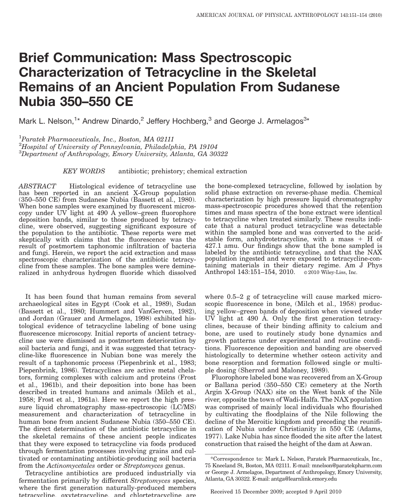
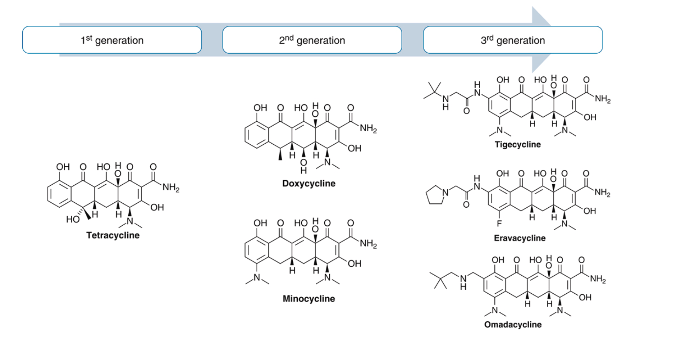
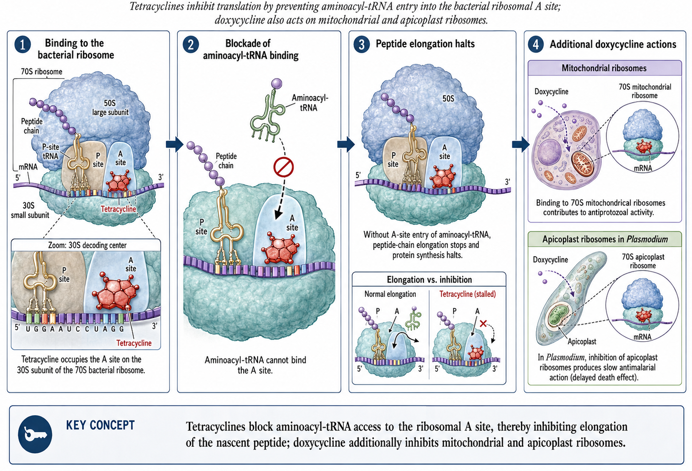

## Tetracyclines, Tetracycline Derivatives <br> and Chloramphenicol {background-color="#b20e10" background-video="tetracyclines-images/swab.mp4" background-video-loop="true" background-video-muted="true" background-opacity="0.4"}

<br>

<br>

<center>

**Russell E. Lewis, Pharm.D., FCCP** <br> Associate Professor of Infectious Diseases (MEDS-10/B) <br>

<br> <br>

{fig-align="center" width="350"}

<br>  russelledward.lewis\@unipd.it <br>  [https://github.com/Russlewisbo](https://github.com/Russlewisbo/ESCMID_2022_talk) <br> Slides and course materials: [www.idpadova.com](https://padovaid.com/)

</center>

# Introduction & Overview {background-color="#b20e10"}

<br>

## Learning Objectives

<br>

After this presentation, you will be able to:

1.  Describe the mechanism of action of tetracyclines
2.  Compare pharmacokinetic properties of different tetracycline generations
3.  Identify key clinical indications for each tetracycline
4.  Recognize important adverse effects and drug interactions
5.  Apply knowledge of newer derivatives (tigecycline, eravacycline, omadacycline)
6.  Select the appropriate tetracycline for specific clinical scenarios

# Historical Overview {background-color="#b20e10"}

## Discovery & Development Timeline

<br>

::::: columns
::: {.column width="30%"}
{fig-align="center" width="150"}
:::

::: {.column width="70%"}
**1948: Benjamin M. Duggar** discovers chlortetracycline

- He isolated from *Streptomyces aureofaciens* at age 76!
- Trade name "Aureomycin" from *aureus* (golden)
:::
:::::

<br> <br>

| Era | Year | Agent | Significance |
|------------------|------------------|------------------|-------------------|
| 1st Gen | 1948-1953 | Chlortetracycline, Oxytetracycline, Tetracycline | Natural products |
| 2nd Gen | 1967-1972 | Doxycycline, Minocycline | Improved PK |
| 3rd Gen | 2005-2018 | Tigecycline, Eravacycline, Omadacycline | Resistance-active |

::: notes
Duggar's discovery launched an entire antibiotic class. The 2018 approvals represented a renaissance driven by resistance concerns [@Duggar1948].
:::

## But was he the first?- Egyptians drank tetracycline beer!

{fig-align="center" width="600"}

::: aside
[@nelson2010]
:::

## The rise of resistance & classification

<br>

**Resistance emerged quickly:**

- First resistance: 1953 (*Shigella dysenteriae*)
- Non-clinical uses (animal feed) accelerated spread
- Led to 33+ resistance genes ("tetracycline resistome")

**Classification by half-life:**

| Category         | Half-life   | Examples                      |
|------------------|-------------|-------------------------------|
| Short-acting     | 6-8 hours   | Tetracycline, Oxytetracycline |
| Intermediate     | 12 hours    | Demeclocycline                |
| Long-acting      | 16-22 hours | Doxycycline, Minocycline      |
| Very long-acting | 37-67 hours | Tigecycline                   |

::: aside
Longer half-life agents allow for less frequent dosing and better compliance [@Roberts2005; @Thaker2010].
:::

# Structure & Mechanism of Action {background-color="#b20e10"}

## Core structure

<br>

{fig-align="center" width="800"}

**All tetracyclines share:** Four-benzene ring structure (hydronaphthacene nucleus)

- Substitutions at C-5, C-6, C-7 determine properties

## **Cell Entry:**

<br>

- **Gram-negative:** Mg²⁺-cation complex → OmpF/OmpC porins → accumulates in periplasm
- **Gram-positive:** Active transport through cytoplasmic membrane (ΔpH dependent)

<br> <br>

::: aside
The cation complex formation is essential for crossing gram-negative outer membranes - also explains why divalent cations interfere with absorption. [@Schnappinger1996]
:::

## Ribosomal binding & protein synthesis inhibition

<br>

{fig-align="center" width="800"}

::: callout-important
Tetracyclines **reversibly** bind to the **30S ribosomal subunit** → **bacteriostatic**...*although clinical importance of bacteriostatic vs. cidal is debated*. Free drug AUC/AUC is the PK/PD driver of activity- Killing (or growth suppression) depends on overall exposure, not peak concentration [@Chopra2001].
:::

# Pharmacokinetics {background-color="#b20e10"}

## Absorption: key differences

<br>

| Drug         | Bioavailability | Food effect | Time to peak |
|--------------|-----------------|-------------|--------------|
| Tetracycline | 77-88%          | ↓50%        | 2-4 hours    |
| Doxycycline  | \~100%          | ↓\<20%      | 2-3 hours    |
| Minocycline  | \~100%          | ↓\<20%      | 2 hours      |

<br> <br> ::: callout-tip \## Clinical Pearl

Doxycycline can be taken with food to reduce GI upset without significantly affecting absorption! :::

::: aside
This is a major practical advantage of doxycycline - patients with nausea can take it with meals [@Cunha2000].
:::

## The critical cation interaction

<br>

::: callout-warning
## Critical drug interaction

Divalent and trivalent cations reduce absorption by **50-90%**
:::

**Problematic agents:** Aluminum, magnesium, calcium (antacids), iron, zinc, multivitamins

**Solution:** Separate administration by **3 hours**

**Patient counseling:**

- Take tetracycline 1 hour before OR 2 hours after meals
- Separate from antacids by 2-3 hours
- Dairy products (milk, yogurt, cheese) also chelate

::: aside
One of the most important interactions to communicate. Many patients don't realize their daily vitamin interferes [@Chopra2001].
:::

## Distribution & elimination

<br>

<center>**Half-life comparison:**</center>

| Drug         | Half-life   | Protein Binding | Lipophilicity |
|--------------|-------------|-----------------|---------------|
| Tetracycline | 7 hours     | 24-65%          | Baseline      |
| Doxycycline  | 12-16 hours | 82-93%          | 5× baseline   |
| Minocycline  | 16-21 hours | 70-80%          | 10× baseline  |
| Tigecycline  | 37-67 hours | 71-89%          | Very high     |

<br> <br>

::: aside
Higher lipophilicity = better tissue penetration. Minocycline's high lipophilicity explains its excellent CSF penetration [@Moffa2024].
:::

## Tissue penetration

<br>

**Doxycycline achieves excellent levels in:**

- Bronchial secretions, pleural fluid
- Sinus, middle ear secretions
- Bone, prostate, testes
- Urine concentrations 10× serum

**Minocycline uniquely penetrates:**

- CSF (11-57% of serum levels)
- Saliva and tears
- Sebum (explaining efficacy in acne)

::: aside
Tissue penetration drives clinical indications. Minocycline's CNS penetration makes it useful for certain infections. **Tetracyclines have high volume of distribution making them poor choices for bloodstream infection** [@Moffa2024].
:::

## Special populations

<br>

**Renal impairment:**

- Tetracycline: **Avoid** (accumulates, worsens azotemia)
- Doxycycline: **No adjustment needed** (Biliary secretion → fecal excretion)
- Minocycline: **No adjustment needed**

**Hepatic impairment:**

- All tetracyclines: Use with caution
- Tigecycline: Reduce dose in Child-Pugh C

::: callout-tip
## Clinical Pearl

Doxycycline is the tetracycline of choice in renal failure!
:::

<br> <br>

::: notes
This is a frequently tested point - Doxycycline's unique elimination makes it safe in renal impairment [@Moffa2024].
:::

# Antimicrobial Spectrum {background-color="#b20e10"}

## Gram-positive coverage

<br>

**Generally susceptible:**

- *Streptococcus pneumoniae* (resistance varies: 20-40%)
- *Streptococcus pyogenes*
- Many *Enterococcus faecalis*
- MRSA (community-acquired strains often susceptible)
- *Listeria monocytogenes*
- *Nocardia, Actinomyces*

::: callout-note
## Note

Newer tetracyclines (tigecycline, eravacycline, omadacycline) have enhanced gram-positive activity including VRE
:::

<br> <br>

::: aside
MRSA susceptibility to doxycycline makes it useful for community skin infections. However, resistance is increasing [@SENTRY1999].
:::

## Gram-negative coverage

<br>

**Susceptible organisms:**

- *Haemophilus influenzae*
- *Brucella* species
- *Vibrio* species (cholera)
- *Yersinia pestis* (plague)
- *Francisella tularensis* (tularemia)
- *Pasteurella multocida* (animal bites)

**Limited or resistant:**

- *Pseudomonas aeruginosa* - **inherently resistant**
- *Proteus* species - often resistant
- Enterobacterales - variable, increasing resistance

<br>

::: aside
The gram-negative spectrum focuses on atypicals and specific pathogens. Not reliable for nosocomial gram-negatives [@Chopra2001].
:::

## Atypical pathogens

<br>

::: callout-tip
## Clinical Pearl

Tetracyclines are first-line for many atypical pathogens!
:::

**Excellent activity against:**

| Organism                | Clinical Syndrome                    |
|-------------------------|--------------------------------------|
| *Chlamydia* spp.        | STIs, pneumonia, psittacosis         |
| *Mycoplasma pneumoniae* | Atypical pneumonia                   |
| *Rickettsia* spp.       | Rocky Mountain spotted fever, typhus |
| *Borrelia burgdorferi*  | Lyme disease                         |
| *Coxiella burnetii*     | Q fever                              |
| *Ehrlichia/Anaplasma*   | Ehrlichiosis/Anaplasmosis            |

<br> <br>

::: aside
Doxycycline is often the drug of choice for tick-borne illnesses due to excellent activity against Rickettsia and related organisms [@Moffa2024].
:::

## Anaerobes & other organisms

<br>

**Anaerobic coverage:**

- Moderate activity against many mouth anaerobes
- *Bacteroides fragilis*: variable (50-70% susceptible)
- Tigecycline: broader anaerobic coverage

**Additional coverage:**

- *Treponema pallidum* (syphilis - alternative to penicillin)
- *Plasmodium* spp. (malaria prophylaxis/treatment)
- *Bacillus anthracis* (anthrax)
- *Actinomyces*, *Nocardia*

::: aside
Doxycycline's activity against T. pallidum makes it the alternative of choice for penicillin-allergic patients with syphilis [@Moffa2024].
:::

# Clinical indications {background-color="#b20e10"}

## Respiratory tract infections

<br>

**Community-Acquired Pneumonia (CAP):**

::: callout-tip
## Guideline Recommendation

Doxycycline is recommended as an alternative to macrolides for outpatient CAP in patients with comorbidities
:::

- Covers atypicals (*M. pneumoniae*, *C. pneumoniae*, *Legionella*)
- Alternative when macrolide resistance is a concern
- Dose: 100 mg BID × 5-7 days

**Other respiratory uses:**

- Acute exacerbations of COPD
- Psittacosis (*C. psittaci*)

::: aside
With rising macrolide resistance in S. pneumoniae, doxycycline has become an increasingly important alternative [@MetlayCAP2019].
:::

## Tick-borne diseases

<br>

**Doxycycline is first-line for:**

| Disease                      | Pathogen             | Duration   |
|------------------------------|----------------------|------------|
| Lyme disease (early)         | *B. burgdorferi*     | 10-14 days |
| Rocky Mountain Spotted Fever | *R. rickettsii*      | 5-7 days   |
| Ehrlichiosis                 | *Ehrlichia* spp.     | 5-14 days  |
| Anaplasmosis                 | *A. phagocytophilum* | 10-14 days |

<br> <br>

::: callout-warning
## Clinical Warning

For RMSF: Start doxycycline empirically - don't wait for serologic confirmation! Delay increases mortality.
:::

::: aside
Empiric treatment of suspected RMSF can be lifesaving. Doxycycline is safe even in children for this indication [@WormsleyLyme2021].
:::

## Sexually transmitted infections

<br>

| Infection | Doxycycline Regimen |
|---------------------------|---------------------------------------------|
| Chlamydia | 100 mg BID × 7 days |
| Syphilis (penicillin allergy) | 100 mg BID × 14 days (early) or 28 days (late) |
| PID (with ceftriaxone + metronidazole) | 100 mg BID × 14 days |
| Epididymitis | 100 mg BID × 10 days |
| LGV | 100 mg BID × 21 days |


<br> <br>

::: callout-note
## Emerging Use

**Doxy-PEP:** Post-exposure prophylaxis (200 mg within 72h) reduces STI incidence by 66% in high-risk populations
:::

::: aside
Doxy-PEP is a major recent development - single dose within 72 hours of exposure significantly reduces gonorrhea, chlamydia, and syphilis[@CDC_STI2021; @DoxyPEP2022].
:::

## Skin & soft tissue infections

<br>

**Community-acquired MRSA SSTI:**

- Doxycycline 100 mg BID or Minocycline 100 mg BID
- Duration: 5-10 days depending on severity

**Acne vulgaris:**

| Agent       | Dose            | Notes                             |
|-------------|-----------------|-----------------------------------|
| Doxycycline | 40-100 mg daily | Lower doses for anti-inflammatory |
| Minocycline | 50-100 mg BID   | Risk of pigmentation, lupus-like  |
| Sarecycline | 60-150 mg daily | Narrow spectrum, fewer GI effects |

::: aside
Sub-antimicrobial doxycycline (40 mg) is effective for acne through anti-inflammatory mechanisms without promoting resistance [@LamotheMRSA2009; @Garner2015].
:::

## Infections requiring combination therapy 

<br>

**Brucellosis:**

- Doxycycline 100 mg BID × 6 weeks + Streptomycin (or Gentamicin) × 2-3 weeks
- OR Doxycycline + Rifampin × 6 weeks

**Q Fever:**

- Acute: Doxycycline 100 mg BID × 14 days
- Chronic/Endocarditis: Doxycycline + Hydroxychloroquine × 18-24 months

**Anthrax (post-exposure):**

- Doxycycline 100 mg BID × 60 days (with vaccine if available)

::: aside
For brucellosis, the combination prevents relapse. Q fever endocarditis requires prolonged therapy [@LamotheMRSA2009; @Garner2015].
:::

## Other important indications

<br>

**Malaria prophylaxis:**

- Doxycycline 100 mg daily (start 1-2 days before, continue 4 weeks after)
- Alternative to mefloquine or atovaquone-proguanil

**Cholera:**

- Single dose doxycycline 300 mg reduces duration

**Periodontitis:**

- Sub-antimicrobial doxycycline (20 mg BID) as adjunct to scaling

**SIADH:**

- Demeclocycline 600-1200 mg/day (induces nephrogenic DI)


::: aside
Demeclocycline's use for SIADH is a classic example of repurposing a side effect for therapeutic benefit [@Dahl2004; @MalariaCDC2023; @Forrest1974].
:::


# Adverse Effects {background-color="#b20e10"}

## Gastrointestinal effects

<br>

**Most common adverse effects:**

- Nausea, vomiting, diarrhea (dose-related- peak concentration drive for IV tigecycline, can be reduced with splitting dosing- for oral doxycycline. GI effects are related to local irritation)
- Esophageal irritation and ulceration

::: callout-warning
## Esophagitis Prevention

- Take with full glass of water
- Remain upright for 30 minutes after dose
- Doxycycline hyclate \> doxycycline monohydrate for this risk
:::

**Management strategies:**

- Take with food (doxycycline, minocycline)
- Use enteric-coated formulations
- Consider dose reduction if tolerating lower doses


::: notes
Esophageal ulceration can be severe. The upright position and water are critical counseling points [@SmithPhotosensitivity1990].
:::

## Photosensitivity

<br>

::: callout-warning
## Clinical Warning

Photosensitivity is dose-related and occurs in up to 20% of patients!
:::

**Risk ranking:**

- Highest: Demeclocycline \> Doxycycline \> Tetracycline
- Lowest: Minocycline (rare)

**Patient counseling:**

- Avoid prolonged sun exposure
- Use SPF 30+ sunscreen
- Wear protective clothing
- Reaction occurs within minutes to hours of UV exposure


::: notes
Photosensitivity is a phototoxic (not allergic) reaction. It can occur even through window glass with UVA [@SmithPhotosensitivity1990].
:::

## Dental & bone effects

<br>

::: callout-caution
## Contraindication

Avoid tetracyclines in pregnancy and children under 8 years (except for life-threatening infections like RMSF)
:::

**Dental effects:**

- Permanent yellow-brown staining
- Enamel hypoplasia
- Risk greatest during tooth development (in utero through age 8)

**Bone effects:**

- Deposit in calcifying tissues
- Reversible decrease in bone growth rate in fetus/young children
- Does not affect already-formed adult bone


::: notes
The age 8 cutoff is when permanent teeth are largely formed. Doxycycline may have lower staining risk than older tetracyclines [@Moffa2024].
:::

## CNS effects (Especially minocycline)

<br>

**Vestibular effects (minocycline):**

- Dizziness, vertigo, ataxia
- Occurs in 30-90% of patients
- More common in women
- Usually reversible within 48-72 hours of stopping

**Other CNS effects:**

- Benign intracranial hypertension (pseudotumor cerebri)
  - Headache, visual changes, papilledema
  - Risk increased with concurrent vitamin A, retinoids

<br> <br>

::: aside
Minocycline's vestibular effects often limit its use. The combination with isotretinoin is particularly concerning for intracranial hypertension [@Garner2015; @Moffa2024].
:::

## Hepatotoxicity

<br>

**Tetracycline-specific:**

- Dose-related (usually with \>2 g/day IV)
- Microvesicular fatty liver
- Historically seen in pregnant women with pyelonephritis
- Rarely reported with modern dosing

**Tigecycline:**

- Elevated LFTs in 5% of patients
- Cases of hepatic failure reported
- Contributes to FDA warnings

<br> <br>

::: aside
High-dose IV tetracycline is no longer used, but this historical toxicity is why the class carries pregnancy warnings [@FDAWarningTige2010; @Moffa2024].
:::

## Minocycline-specific effects

<br>

**Unique adverse effects:**

| Effect                      | Incidence | Characteristics                     |
|-------------------|----------------------|-------------------------------|
| Blue-gray skin pigmentation | Rare      | Sun-exposed areas, may be permanent |
| Drug-induced lupus          | Rare      | ANA positive, arthritis             |
| Hypersensitivity syndrome   | Rare      | DRESS syndrome                      |
| Autoimmune hepatitis        | Rare      | Often with long-term use            |
| Eosinophilic pneumonitis    | Rare      | Occurs early in treatment           |

<br> <br>

::: callout-note
## aside

Most minocycline-specific effects are associated with prolonged use (acne treatment)
:::


::: aside
The pigmentation can be disfiguring and may not fully resolve. Monitor for lupus-like symptoms in long-term users [@Garner2015].
:::


# Drug interactions {background-color="#b20e10"}

## Major drug interactions

<br>

| Interacting Drug        | Effect                  | Management          |
|-------------------------|-------------------------|---------------------|
| Antacids, iron, calcium | ↓ Absorption 50-90%     | Separate by 3 hours |
| Warfarin                | ↑ INR                   | Monitor closely     |
| Oral contraceptives     | Potential ↓ efficacy    | Use backup method   |
| Isotretinoin            | ↑ Intracranial pressure | Avoid combination   |
| Methotrexate            | ↑ MTX levels            | Monitor toxicity    |
| Digoxin                 | ↑ Digoxin levels (10%)  | Monitor levels      |


::: aside
The warfarin interaction is clinically significant - always check INR when starting/stopping tetracyclines in anticoagulated patients [@Moffa2024].
:::

## Practical Management

<br>

::: callout-tip
## Clinical Pearl

When multiple interactions exist, consider alternative antibiotics rather than complex scheduling
:::

**Key counseling points:**

1.  Take tetracyclines 1 hour before or 2 hours after antacids
2.  Separate from dairy products
3.  Women on OCs should use backup contraception
4.  Report signs of bleeding if on warfarin
5.  Never combine with isotretinoin

::: aside
[@Moffa2024]
:::

::: notes
Complex medication schedules reduce compliance. Sometimes switching to azithromycin or a fluoroquinolone is more practical.
:::

------------------------------------------------------------------------

# Resistance Mechanisms {background-color="#b20e10"}

## Three Major Mechanisms

<br>

**1. Efflux Pumps (most common):**

- Tet(A), Tet(B), Tet(K), Tet(L), etc.
- Actively pump tetracycline out of cell
- Energy-dependent (proton motive force)
- Encoded on plasmids → easily transferable

**2. Ribosomal Protection Proteins:**

- Tet(M), Tet(O)
- GTPases that "rescue" ribosomes
- Release tetracycline from 30S binding site
- Dislodge drug without damaging ribosome

::: aside
[@Chopra2001; @Roberts2005]
:::

::: notes
Efflux is the most common mechanism. Ribosomal protection is especially important in gram-positive organisms.
:::

## Resistance Mechanisms (continued)

<br>

**3. Enzymatic Inactivation:**

- Tet(X) - NADPH-dependent monooxygenase
- Inactivates tetracycline by adding hydroxyl group
- Rare but concerning (can affect tigecycline)
- Tet(X3), Tet(X4) emerging as threat

**Current resistance landscape:**

- 33+ resistance genes identified
- Often carried on mobile genetic elements
- Multiple mechanisms may coexist

::: aside
[@Thaker2010]
:::

::: notes
Tet(X) enzymes are concerning because they can inactivate even the newer glycylcyclines. Surveillance is ongoing.
:::

## How Newer Tetracyclines Overcome Resistance

<br>

| Agent        | Overcomes Efflux | Overcomes Ribosomal Protection |
|--------------|------------------|--------------------------------|
| Doxycycline  | Partially        | No                             |
| Minocycline  | Partially        | No                             |
| Tigecycline  | Yes              | Yes                            |
| Eravacycline | Yes              | Yes                            |
| Omadacycline | Yes              | Yes                            |

**Key structural modifications:**

- C-9 glycylamido group (tigecycline)
- Enhanced ribosomal binding affinity
- Steric hindrance prevents efflux pump recognition

::: aside
[@Bergeron2016]
:::

::: notes
The glycylcycline structure was specifically designed to evade common resistance mechanisms. However, Tet(X) can still inactivate some of these.
:::

------------------------------------------------------------------------

# Newer Tetracycline Derivatives {background-color="#b20e10"}

## Tigecycline (Glycylcycline) {.smaller}

<br>

**Key features:**

- First glycylcycline (FDA approved 2005)
- IV only, 100 mg loading then 50 mg q12h
- Higher dose: 200 mg loading, then 100 mg daily (greater N&V)
- Broadest spectrum of tetracyclines

**FDA-approved indications:**

- Complicated skin/skin structure infections
- Complicated intra-abdominal infections
- Community-acquired bacterial pneumonia

::: callout-warning
## FDA Black Box Warning

Increased mortality compared to other antibiotics in meta-analysis. Reserve for situations where alternatives are not suitable.
:::

::: aside
[@Ellis-GrosseTige2005; @FDABoxWarningTige2013]
:::

::: notes
The mortality signal led to FDA warnings. Tigecycline should not be used for VAP or bacteremia due to low serum levels. Mortality difference was not seen with the higher dose
:::

## Tigecycline: Clinical Considerations {.smaller}

<br>

**Advantages:**

- Active against MRSA, VRE, ESBL-producers
- Excellent tissue penetration (Vd = 7-10 L/kg)
- Good anaerobic coverage

**Limitations:**

- Low serum concentrations → avoid for bacteremia
- No *Pseudomonas* activity
- High rate of nausea/vomiting (30%)- can be reduced by splitting doses (activity AUC/MIC driven, N&V is peak related)
- Increased mortality signal

**When to consider:**

- MDR intra-abdominal infections
- MDR skin infections when oral options inadequate
- *Not* for VAP, bloodstream infections, or diabetic foot infections

::: aside
[@BabinchakTige2005; @FDAWarningTige2010]
:::

::: notes
The large volume of distribution means excellent tissue levels but inadequate serum concentrations for bacteremia.
:::

## Eravacycline (Fluorocycline) {.smaller}

<br>

**Key features:**

- Fluorocycline class (FDA approved 2018)
- IV only: 1 mg/kg q12h
- 2-4× more potent than tigecycline in vitro

**FDA-approved indication:**

- Complicated intra-abdominal infections

**Advantages over tigecycline:**

- More potent against Enterobacterales
- Similar spectrum but better MICs
- Better tolerability (less nausea)

::: aside
[@Solomkin2014; @MolloyErava2018]
:::

::: notes
Eravacycline was developed to improve on tigecycline's limitations. It's currently limited to cIAI.
:::

## Omadacycline (Aminomethylcycline) {.smaller}

<br>

**Key features:**

- Aminomethylcycline class (FDA approved 2018)
- **Both IV and oral** formulations available
- Oral bioavailability: \~35%

**FDA-approved indications:**

- Community-acquired bacterial pneumonia
- Acute bacterial skin and skin structure infections

::: callout-tip
## Clinical Pearl

Omadacycline is the only newer tetracycline with oral availability - allows IV-to-oral switch!
:::

::: aside
[@OKeefeCABP2019]
:::

::: notes
The oral formulation is a major advantage. Loading dose of 450 mg day 1, then 300 mg daily.
:::

## Omadacycline: Clinical Use

<br>

**Dosing:**

| Indication | Loading                    | Maintenance                  |
|------------|----------------------------|------------------------------|
| CABP       | 200 mg IV or 300 mg PO × 2 | 100 mg IV or 300 mg PO daily |
| ABSSSI     | 200 mg IV or 450 mg PO     | 100 mg IV or 300 mg PO daily |

**Key advantages:**

- Oral option for serious infections
- Activity against MRSA, atypicals
- Better tolerability than tigecycline
- No food effect on absorption (take on empty stomach)

::: aside
[@Stets2019]
:::

::: notes
The ability to complete therapy orally makes omadacycline practical for outpatient treatment or early discharge.
:::

## Sarecycline (Narrow-Spectrum)

<br>

**Unique positioning:**

- FDA approved 2018 for **acne vulgaris only**
- Specifically designed narrow spectrum
- Less impact on gut flora than other tetracyclines
- Weight-based dosing (60-150 mg once daily)

**Not indicated for infections!**

- Lower activity against typical respiratory pathogens
- Designed to target *Cutibacterium acnes*

::: aside
[@Moffa2024]
:::

::: notes
Sarecycline represents a deliberate narrow-spectrum approach to minimize collateral damage and resistance selection.
:::

## Comparing Newer Tetracyclines

<br>

| Feature           | Tigecycline       | Eravacycline        | Omadacycline |
|-------------------|-------------------|---------------------|--------------|
| Route             | IV only           | IV only             | IV and PO    |
| Approved uses     | cSSSI, cIAI, CABP | cIAI                | CABP, ABSSSI |
| Pseudomonas       | No                | No                  | No           |
| Black box warning | Yes (mortality)   | No                  | No           |
| Dosing frequency  | q12h              | q12h                | Daily        |
| Main limitation   | Low serum levels  | Limited indications | Cost         |

::: aside
[@Moffa2024]
:::

::: notes
Selection depends on indication, need for oral therapy, and patient-specific factors.
:::

------------------------------------------------------------------------

# Chloramphenicol {background-color="#b20e10"}

## Historical Context & Mechanism

<br>

**History:**

- Discovered 1947 from *Streptomyces venezuelae*
- First antibiotic to be manufactured synthetically (1949)
- Fell from favor due to aplastic anemia

**Mechanism:**

- Binds 50S ribosomal subunit (NOT 30S like tetracyclines)
- Inhibits peptidyl transferase activity
- Prevents peptide bond formation
- **Bacteriostatic** (bactericidal against some organisms)

::: aside
[@Mandell2024]
:::

::: notes
Chloramphenicol's toxicity limited its use in developed countries, but it remains important in resource-limited settings.
:::

## Chloramphenicol: Spectrum & Uses

<br>

**Broad spectrum coverage:**

- Gram-positives (including many resistant organisms)
- Gram-negatives (including *H. influenzae*, *N. meningitidis*)
- Anaerobes
- Rickettsiae, spirochetes

**Current uses:**

- Rickettsial infections (when doxycycline contraindicated)
- Bacterial meningitis (resource-limited settings)
- Ophthalmic infections (topical)
- Alternative for serious infections in beta-lactam allergy

::: aside
[@Mandell2024]
:::

::: notes
Oral chloramphenicol is still available for travelers to areas with limited alternatives.
:::

## Chloramphenicol: Toxicity {.smaller}

<br>

::: callout-caution
## Critical Toxicity

**Aplastic anemia** - idiosyncratic, not dose-related, often fatal (1 in 20,000-40,000)
:::

**Types of bone marrow toxicity:**

| Type | Mechanism | Reversibility | Risk |
|------------------|------------------|-------------------|------------------|
| Dose-related suppression | Mitochondrial inhibition | Reversible | Common |
| Aplastic anemia | Idiosyncratic | Usually fatal | Rare (1:20,000-40,000) |

**Other toxicities:**

- **Gray baby syndrome:** Cardiovascular collapse in neonates
  - Due to immature glucuronidation
  - Abdominal distension, cyanosis, shock
- Optic neuritis (prolonged use)

::: aside
[@Mandell2024]
:::

::: notes
The risk of aplastic anemia, though rare, is the main reason chloramphenicol fell from widespread use in developed countries.
:::

------------------------------------------------------------------------

# Practical Prescribing {background-color="#b20e10"}

## Tetracycline Selection Algorithm {.smaller}

<br>

```         
Is the patient pregnant or <8 years old?
    │
    ├─► Yes: Avoid tetracyclines (except life-threatening RMSF)
    │
    └─► No: Continue ↓
         │
         Is renal function impaired?
              │
              ├─► Yes: Use DOXYCYCLINE (no adjustment needed)
              │
              └─► No: Choose based on indication
                       │
                       ├─► Atypicals/Tick-borne: Doxycycline
                       ├─► CNS infection: Minocycline
                       ├─► Acne: Doxycycline, Minocycline, or Sarecycline
                       └─► MDR GN/GN infections: Tigecycline or Eravacycline
```

::: notes
This simple algorithm covers most clinical scenarios. Doxycycline is the most versatile choice.RMSF: Rocky mountain spotted fever
:::

## Available Formulations

<br>

| Drug         | Formulations               | Standard Dose                  |
|--------------|----------------------------|--------------------------------|
| Doxycycline  | PO (tabs, caps, syrup), IV | 100 mg q12h                    |
| Minocycline  | PO, IV, topical            | 100 mg q12h                    |
| Tigecycline  | IV only                    | 50 mg q12h (after 100 mg load) |
| Eravacycline | IV only                    | 1 mg/kg q12h                   |
| Omadacycline | PO, IV                     | 300 mg PO or 100 mg IV daily   |
| Sarecycline  | PO only                    | 60-150 mg daily (weight-based) |

::: notes
Omadacycline's dual formulation makes it unique among the newer agents.
:::

## Key Counseling Points

<br>

**For all tetracyclines:**

1.  Avoid dairy and antacids (separate by 2-3 hours)
2.  Take with full glass of water, stay upright 30 minutes
3.  Use sun protection (especially doxycycline)
4.  Complete full course even if feeling better

**For specific agents:**

- Minocycline: Report dizziness, skin discoloration
- Doxycycline: Can take with food if nauseated
- Tetracycline: Must take on empty stomach

::: notes
Effective counseling improves adherence and reduces adverse effects.
:::

------------------------------------------------------------------------

# Summary {background-color="#b20e10"}

## Key Takeaways (Part 1)

<br>

1.  **Mechanism:** Tetracyclines bind 30S ribosome, block protein synthesis (bacteriostatic)- activity is AUC/MIC driven, N&V with IV formulations is related to peak serum levels
2.  **Doxycycline is the workhorse:** Best oral bioavailability, can take with food, safe in renal impairment
3.  **First-line for tick-borne diseases:** Start empirically for suspected Rocky Mountain Spotted Fever - don't wait for confirmation
4.  **Important for STIs:** Chlamydia, syphilis (alternative), growing role in Doxy-PEP

::: notes
These are the most critical points for clinical practice.
:::

## Key Takeaways (Part 2)

<br>

5.  **Drug interactions are critical:** Cations reduce absorption 50-90%, warfarin effect increased
6.  **Avoid in pregnancy/children \<8:** Dental staining and bone effects
7.  **Newer agents expand options:** Tigecycline, eravacycline, omadacycline overcome resistance
8.  **Tigecycline limitations:** Not for bacteremia, black box mortality warning

::: notes
The newer agents are valuable but have specific niches and limitations.
:::

## Clinical Decision Making

<br>

::: callout-important
## Bottom Line

Doxycycline remains the most versatile tetracycline for clinical practice, with excellent oral bioavailability, broad spectrum, and unique indications for atypicals and tick-borne diseases. Reserve newer agents for MDR infections or when oral therapy with omadacycline is preferred.
:::

::: notes
End with this practical summary for clinical application.
:::

------------------------------------------------------------------------

# Questions? {background-color="#b20e10"}

## Further Reading & Resources {.smaller}

<br>

**Key References:**

- Chopra I, Roberts MC. Microbiol Mol Biol Rev 2001;65:232-260
- CDC STI Treatment Guidelines 2021
- IDSA Lyme Disease Guidelines 2020
- ATS/IDSA CAP Guidelines 2019

**Clinical Pearls to Remember:**

1.  Doxycycline = workhorse tetracycline
2.  Empiric RMSF treatment saves lives
3.  Separate from cations by 3 hours
4.  Safe in renal failure (doxycycline)
5.  Tigecycline: Not for bacteremia

------------------------------------------------------------------------

# Appendix: Reference Tables {background-color="#b20e10"}

## Spectrum of Activity Summary

<br>

| Organism         | TET | DOX | MIN | TIG | ERA | OMA |
|------------------|-----|-----|-----|-----|-----|-----|
| MSSA             | S   | S   | S   | S   | S   | S   |
| MRSA             | V   | V   | V   | S   | S   | S   |
| VRE              | R   | R   | R   | S   | S   | S   |
| S. pneumoniae    | V   | V   | V   | S   | S   | S   |
| Atypicals        | S   | S   | S   | S   | S   | S   |
| Enterobacterales | V   | V   | V   | S   | S   | V   |
| *P. aeruginosa*  | R   | R   | R   | R   | R   | R   |
| Anaerobes        | V   | V   | V   | S   | S   | V   |

S = susceptible, V = variable, R = resistant

## MIC Reference Values

<br>

| Organism               | Doxycycline | Tigecycline |
|------------------------|-------------|-------------|
| *S. aureus* (MSSA)     | ≤0.25       | ≤0.12       |
| *S. pneumoniae*        | ≤1          | ≤0.06       |
| *E. coli*              | ≤4          | ≤0.5        |
| *K. pneumoniae*        | ≤4          | ≤1          |
| *Bacteroides fragilis* | ≤4          | ≤4          |

*Values in μg/mL; breakpoints per CLSI*

## Dosing Quick Reference

<br>

| Indication | Agent | Dose | Duration |
|-------------------|------------------|------------------|------------------|
| CAP | Doxycycline | 100 mg BID | 5-7 days |
| Chlamydia | Doxycycline | 100 mg BID | 7 days |
| Lyme (early) | Doxycycline | 100 mg BID | 10-14 days |
| RMSF | Doxycycline | 100 mg BID | 5-7 days |
| MRSA SSTI | Doxycycline | 100 mg BID | 5-10 days |
| Malaria prophylaxis | Doxycycline | 100 mg daily | Duration of exposure + 4 weeks |
| cIAI | Tigecycline | 50 mg q12h\* | 5-14 days |
| CABP | Omadacycline | 300 mg PO daily\*\* | 5-7 days |

\*After 100 mg loading dose; \*\*After 300 mg × 2 loading

------------------------------------------------------------------------
::::::::::::::::::::::::::::::::::::::::::::::::::::::::::::::::::::::::::::::::
